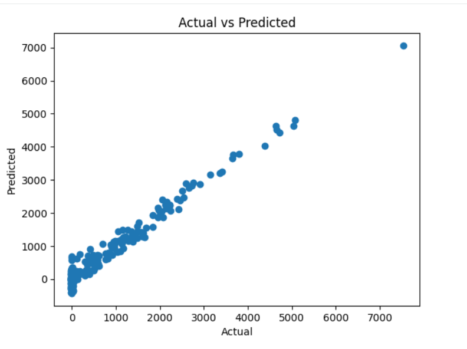
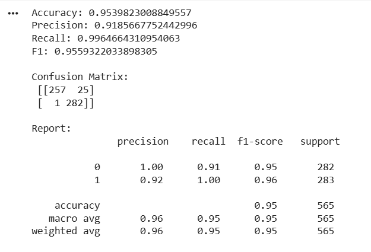

<div align="center">

# 🌍 Global Sales Performance & Profitability Insights

### End-to-End Business Intelligence & Data Analytics Project

From Raw Data to Business Insights using **Excel, SQL, Power BI, Tableau & Python**


</div>

---

# 📖 Project Overview

This project presents a complete Business Intelligence workflow designed to analyze global sales performance and profitability.

Starting from raw transactional sales data, the project applies data cleaning, SQL analysis, dashboard development, and business intelligence techniques to uncover valuable insights that support strategic decision-making.

The objective is to transform raw business data into meaningful visual analytics that help stakeholders understand revenue trends, customer behavior, regional performance, product profitability, and operational efficiency.

---

# 🎯 Business Problem

Organizations generate thousands of sales transactions every year, making it difficult to manually identify:

- Best-selling products
- Most profitable categories
- High-value customers
- Regional performance
- Monthly sales trends
- Impact of discounts on profitability
- Shipping efficiency

This project provides an interactive analytical solution that helps decision-makers monitor business performance and identify opportunities for growth.

---

# 🚀 Project Workflow

```text
Raw Sales Dataset
        │
        ▼
Excel Data Cleaning
        │
        ▼
SQL Data Exploration
        │
        ▼
Business Analysis
        │
        ▼
Power BI Dashboard
        │
        ▼
Tableau Dashboard
        │
        ▼
Business Insights
        │
        ▼
Strategic Recommendations
```

---

# 🛠 Technology Stack

| Technology | Purpose |
|------------|---------|
| Excel | Data Cleaning & Validation |
| SQL | Data Exploration & KPI Analysis |
| Power BI | Interactive Dashboard Development |
| Tableau | Data Visualization |
| Python | Data Processing |
| Git & GitHub | Version Control & Documentation |

---

# 📂 Dataset

The dataset contains information about:

- Orders
- Customers
- Products
- Product Lines
- Sales
- Profit
- Quantity
- Discounts
- Shipping Status
- Deal Size
- Countries
- States
- Cities
- Order Dates

---

# 📊 Excel Analysis

Excel was used for:

- Data Cleaning
- Removing Duplicates
- Handling Missing Values
- Formatting Data
- Pivot Tables
- Pivot Charts
- KPI Calculations
- Initial Dashboard

---

# 🗄 SQL Analysis

SQL was used to answer important business questions including:

- Top Selling Products
- Most Profitable Products
- Monthly Sales Trend
- Customer Analysis
- Country Performance
- Product Line Analysis
- Deal Size Analysis
- Order Status Analysis
- Top & Bottom Performing Products

---


# 🤖 Machine Learning Analysis

Machine Learning techniques were applied to build and evaluate a predictive model based on the prepared dataset.

## Workflow

```text
Data Cleaning
      │
      ▼
Feature Engineering
      │
      ▼
Train / Test Split
      │
      ▼
Model Training
      │
      ▼
Prediction
      │
      ▼
Model Evaluation
```

---

## Model Evaluation

The model was evaluated using multiple performance metrics:

| Metric | Score |
|---------|-------:|
| Accuracy | 95.40% |
| Precision | 91.86% |
| Recall | 99.65% |
| F1 Score | 95.59% |

---

## Evaluation Metrics

- Accuracy
- Precision
- Recall
- F1 Score
- Confusion Matrix
- Classification Report
- Actual vs Predicted Visualization

---

## Model Performance

The model achieved excellent predictive performance with an accuracy of approximately **95%**, demonstrating strong generalization on unseen data.

The confusion matrix indicates a very small number of misclassified samples, while the classification report shows consistently high Precision, Recall, and F1-Score across both classes.

---

## Model Visualization

### Actual vs Predicted

<p align="center">

</p>

---

### Confusion Matrix & Classification Report

<p align="center">

</p>
# 📈 Power BI Dashboard

The Power BI dashboard provides a complete interactive business overview.

## Dashboard Features

- Executive KPI Cards
- Monthly Sales Analysis
- Profit Analysis
- Country Performance
- City Performance
- Product Line Analysis
- Order Status Distribution
- Deal Size Analysis
- Interactive Filters

---

## Dashboard Preview

<p align="center">

</p>

---

# 📉 Tableau Dashboard

The Tableau dashboard complements the Power BI dashboard through additional interactive visualizations.

Features include:

- Sales Trends
- Geographic Analysis
- Product Performance
- Customer Segmentation
- Regional Performance

---

# 📌 Key Performance Indicators (KPIs)

| KPI | Value |
|------|------:|
| Total Sales | 10M |
| Total Profit | 2M |
| Total Orders | 3K |
| Quantity Sold | 99K |
| Countries | Multiple |
| Product Lines | 7 |

---

# 📊 Business Questions Answered

- Which products generate the highest sales?
- Which product lines are the most profitable?
- Which countries generate the highest revenue?
- Which cities contribute the most sales?
- How do discounts impact profitability?
- Which deal sizes produce the highest revenue?
- How are orders distributed by status?
- What are the monthly sales trends?

---

# 💡 Key Insights

- Generated more than **10 Million** in total sales.
- Achieved approximately **2 Million** in total profit.
- The majority of orders were successfully shipped.
- Classic Cars represented the largest product line.
- Medium deal size generated the highest sales contribution.
- Revenue increased significantly during the final months of the year.
- Sales performance varies considerably across countries and cities.
- A small number of product lines contribute a large portion of total revenue.

---

# 📈 Business Recommendations

- Focus marketing campaigns on high-performing product lines.
- Reduce excessive discounts that negatively affect profitability.
- Increase inventory for top-selling products.
- Expand operations in high-performing regions.
- Monitor underperforming products and optimize pricing strategies.
- Improve forecasting using historical monthly sales trends.

---

# 📁 Repository Structure

```text
Global-Sales-Performance-Profitability-Insights

│
├── Assets
│   ├── badges
│   │   ├── excel.svg
│   │   ├── sql.svg
│   │   ├── power-bi.svg
│   │   ├── tableau.svg
│   │   └── python.svg
│   │
│   └── powerbi-dashboard.png
│
├── Excel
│   ├── Raw Data.xlsx
│   ├── Clean Data.xlsx
│   └── Dashboard.xlsx
│
├── SQL
│   ├── Data Cleaning.sql
│   ├── Business Questions.sql
│   ├── KPI Queries.sql
│   └── Analysis.sql
│
├── Power BI
│   └── Sales Performance Dashboard.pbix
│
├── Tableau
│   └── Sales Dashboard.twbx
│
├── README.md
└── LICENSE
```

---

# 🎯 Skills Demonstrated

- Data Cleaning
- Data Analysis
- SQL Query Writing
- Data Modeling
- Business Intelligence
- Dashboard Design
- KPI Development
- Power BI
- Tableau
- Excel
- Python
- Business Storytelling
- Data Visualization
- Git & GitHub

---

# 👨‍💻 Author

**Khaled Elserry**
**Data Analyst | Business Intelligence | Machine Learning**
- GitHub: [KhaledElserry](https://github.com/KhaledElserry)
- LinkedIn: [Khaled Elserry](https://www.linkedin.com/in/khaledelserry/)
- Email: [khaledomarabdelmoneam@gmail.com](mailto:khaledomarabdelmoneam@gmail.com)
- Phone: [+201091827693](tel:+201091827693)
---


If you found this project useful, consider giving it a ⭐ on GitHub.
